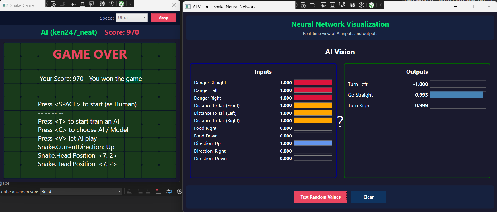

# Snake.AI

A .NET 8 project that implements an AI-powered Snake game using neural networks. The project consists of multiple interconnected components for game logic, AI decision-making, and a WPF user interface.

## Overview

This repository contains a complete Snake game implementation with AI capabilities:
- **Game Engine**: Core game logic and state management
- **AI Module**: Neural network-based snake controllers with NEAT-style training
- **WPF UI**: Windows Presentation Foundation interface with AI visualization
- **Test Suite**: Unit tests for core functionality

## Project Structure

### Projects

| Project | Purpose |
|---------|---------|
| **Game.Core** | Core game engine with game mechanics and state management |
| **Snake.Core** | Snake-specific game logic and controllers |
| **Snake.AI** | AI controllers using neural networks to play Snake |
| **Snake.UI.WPF** | Windows Presentation Foundation UI for visualization and control |
| **Project.Test** | Unit tests for core functionality |

## Technology Stack

- **.NET 8**: All projects target .NET 8.0 with .NET 8.0-windows for WPF
- **WPF**: User interface framework for visualization
- **C# 12**: Modern language features with nullable reference types enabled

## Getting Started

### Prerequisites

- .NET 8 SDK or later
- Visual Studio 2022 or later (recommended) or any compatible C# IDE

### Building

```bash
dotnet build
```

### Running

```bash
dotnet run --project Snake.UI.WPF/Snake.UI.csproj
```

## Screenshots



## Features

### Game Mechanics
- Classic Snake gameplay with grid-based movement
- Food spawning and collision detection
- Self-collision and boundary detection

### AI Integration
- Neural network-based decision making via `ISnakeGameController` interface
- Real-time visualization of neural network inputs and outputs
- Support for various AI controller implementations

### User Interface
- WPF-based graphical interface
- AI Vision Control for real-time neural network visualization
  - Displays up to 30 inputs and 10 outputs
  - Color-coded input categories
  - Progress bars showing normalized values

## Architecture

### Core Interfaces

```csharp
// Snake game state representation
public class SnakeGameState
{
    // Contains snake position, food position, and game status
}

// AI controller interface
public interface ISnakeGameController
{
    Direction2D GetNextMove(SnakeGameState state);
}
```

### Dependencies

- `Snake.AI` ? `Game.Core`, `Snake.Core`
- `Snake.UI.WPF` ? `Snake.AI`, `Snake.Core`
- `Snake.Core` ? `Game.Core`

## Usage Examples

### Implementing a Custom AI Controller

```csharp
public class MyCustomController : ISnakeGameController
{
    public Direction2D GetNextMove(SnakeGameState state)
    {
        // Your AI logic here
        return Direction2D.Up; // Example
    }
}
```

### Running with AI

```csharp
// Create an AI controller
var aiController = new MyCustomController();

// Use it in the game
var nextDirection = aiController.GetNextMove(gameState);
```

### Visualizing Neural Network Activity

The AI Vision Control provides real-time visualization of neural network inputs and outputs. See [Snake.UI.WPF/Controls/AIVisionControl_README.md](Snake.UI.WPF/Controls/AIVisionControl_README.md) for detailed usage instructions.

## Testing

Run tests with:

```bash
dotnet test
```

Tests are located in the `Project.Test` project.

## Project Files

- `Snake.Core/Snake.Core.csproj` - Snake game core logic
- `Snake.UI.WPF/Snake.UI.csproj` - WPF user interface
- `Project.Test/Project.Test.csproj` - Unit tests
- `Game.Core/Game.Core.csproj` - Generic game engine
- `Snake.AI/Snake.AI.csproj` - AI controllers and neural networks

## Development

### Code Style

- Uses implicit usings
- Nullable reference types enabled
- Modern C# 12 language features

### Building from Source

```bash
# Clean build
dotnet clean
dotnet build

# Rebuild
dotnet rebuild

# Run tests
dotnet test

# Publish (if needed)
dotnet publish -c Release
```

## License

Check the repository for license information.

## Contributing

Contributions are welcome! Please feel free to submit pull requests or open issues for bugs and feature requests.

## Related Documentation

- [AI Vision Control Guide](Snake.UI.WPF/Controls/AIVisionControl_README.md) - Real-time neural network visualization

## Author

Created by Maik-Robin (https://github.com/Maik-Robin/Snake.AI)
